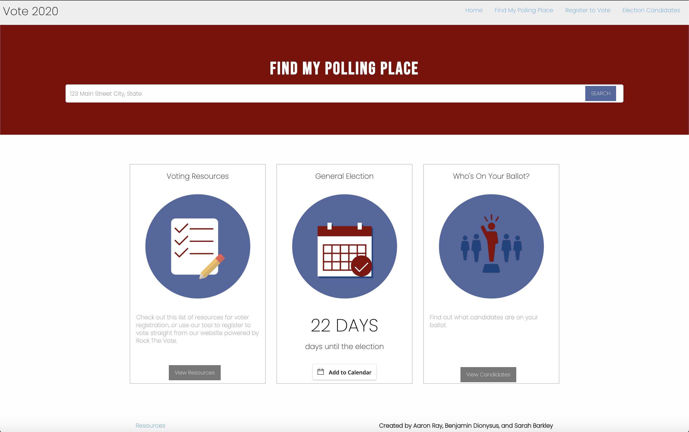

# Vote 2020
## First Group Project for Northwestern Coding Bootcamp
[Live URL](https://b-dionysus.github.io/project1-Election/index.html)

### Description:
Do you know where your voting, and do you know who’s on the ballot? We understand how much information is out there, and how hard it is to have it be readily available in one place. So we created a resource: A single website that presents the user with useful voting tools, such as:
* Polling location 
* Ballot information
* Voter Registration links

### User Story:
As a first time and/or inexperienced voter, I want a site that gives me all the voting information I need. Such as my polling locations, ballot information, and how to register to vote. 

